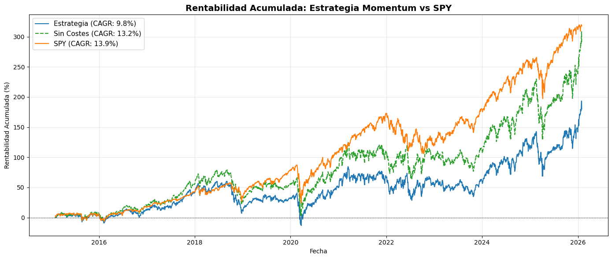
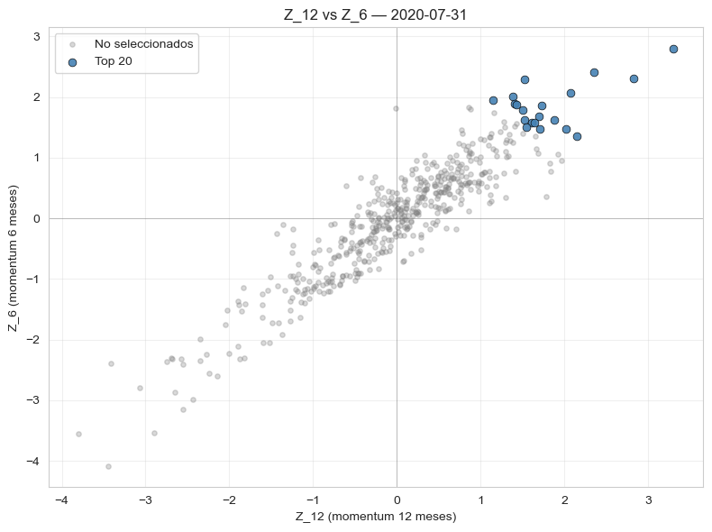
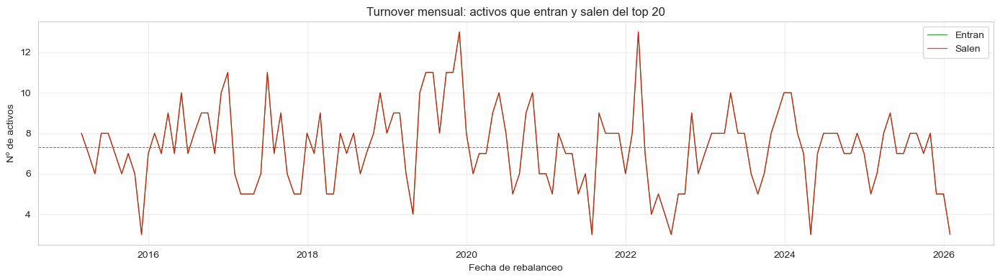
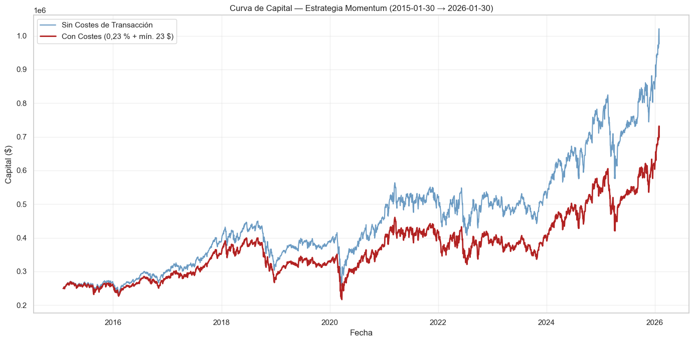
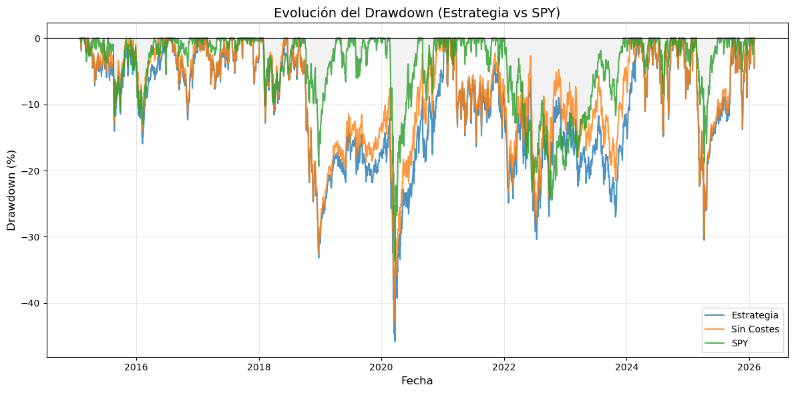
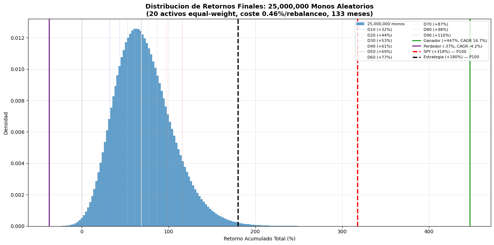
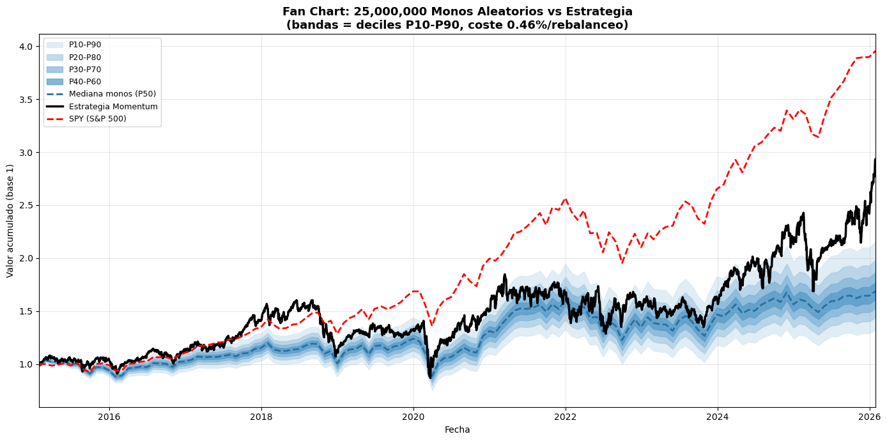

# Backtesting de una estrategia Momentum (metodología MSCI) sobre el S&P 500


Práctica del módulo **Diseño de Algoritmos de Inversión y Backtesting Avanzado**.
Diseño, implementación y backtesting completo de una estrategia de *momentum* que replica la
esencia de la metodología del ETF **MSCI Momentum** sobre el universo del S&P 500, con
rebalanceo mensual, reglas de ejecución `OPEN`/`CLOSE`, estructura de costes real y un test de
robustez de **25 millones de agentes aleatorios**.

📄 Enunciado original: [`docs/enunciado-practica.pdf`](docs/enunciado-practica.pdf)

---

## Tabla de contenidos

1. [Resumen ejecutivo](#1-resumen-ejecutivo)
2. [El encargo](#2-el-encargo)
3. [Estructura del repositorio](#3-estructura-del-repositorio)
4. [Instalación y reproducción](#4-instalación-y-reproducción)
5. [Metodología y decisiones de diseño](#5-metodología-y-decisiones-de-diseño)
6. [Resultados](#6-resultados)
7. [Test de robustez: 25 millones de monos](#7-test-de-robustez-25-millones-de-monos)
8. [Análisis crítico](#8-análisis-crítico)
9. [Limitaciones y líneas de mejora](#9-limitaciones-y-líneas-de-mejora)
10. [Trazabilidad con los criterios de evaluación](#10-trazabilidad-con-los-criterios-de-evaluación)

---

## 1. Resumen ejecutivo

Se simula una cartera de 250.000 $ que, el último día hábil de cada mes entre **enero de 2015 y
enero de 2026** (133 rebalanceos), compra los 20 activos del S&P 500 con mayor *score* de
momentum compuesto, al 5 % cada uno.

| Métrica | Estrategia (con costes) | Estrategia (sin costes) | SPY |
|---|---:|---:|---:|
| Retorno total | +180,03 % | +290,27 % | +317,80 % |
| **CAGR** | **9,82 %** | 13,19 % | **13,89 %** |
| Volatilidad anualizada | 25,43 % | 25,37 % | 17,75 % |
| Ratio de Sharpe | 0,424 | 0,543 | 0,718 |
| Ratio de Sortino | 0,585 | 0,752 | 1,007 |
| Máximo *drawdown* | −45,83 % | −42,86 % | −33,72 % |
| Alpha de Jensen (anual) | −3,43 % *(p = 0,466)* | −0,45 % *(p = 0,926)* | — |
| Beta vs SPY | 1,1187 | 1,1159 | 1,0000 |

*Periodo 2015-02-02 → 2026-01-30 (11,0 años), 2.766 observaciones diarias. Tasa libre de riesgo
= BIL, 1,87 % anual. Capital final con costes: **698.506 $**.*

**Cuatro conclusiones:**

1. **Los costes se comen la estrategia.** Pagar comisiones de `max(23 $; 0,23 %)` con un turnover
   de ~7 activos/mes cuesta **121.736 $** en comisiones nominales, pero **277.173 $** de capital
   final por el efecto compuesto: **−3,4 puntos porcentuales de CAGR al año**. El mínimo de 23 $
   se activó en el **47,1 %** de las órdenes.
2. **La estrategia no bate al benchmark**, ni siquiera antes de costes (13,19 % vs 13,89 %). El
   alpha de Jensen es negativo y **estadísticamente no significativo** (p = 0,466): no hay
   evidencia de generación de alpha en este periodo.
3. **Sí bate al azar.** Frente a 25.000.000 de carteras aleatorias construidas sobre el mismo
   universo elegible, la estrategia se sitúa en el **percentil 99,6**. La selección por momentum
   aporta información real, aunque la ventaja está algo inflada porque a los monos se les aplica
   un modelo de costes más severo que al motor real (ver §8).
4. **Perfil de riesgo agresivo.** Beta 1,12 y un *drawdown* 12 pp más profundo que el del índice,
   consecuencia de la concentración estructural en semiconductores y tecnología que produce el
   factor momentum (NVDA aparece en 77 de los 133 rebalanceos).



---

## 2. El encargo

### 2.1 Especificaciones de la simulación

| Parámetro | Valor |
|---|---|
| Capital inicial | 250.000 $ |
| Periodo de backtest | 01-01-2015 → actualidad (datos hasta 30-01-2026) |
| Universo | Activos del S&P 500 (pertenencia histórica, `in_sp500`) |
| Benchmark | SPY (S&P 500 ETF Trust) |
| Rebalanceo | Último día hábil bursátil de cada mes |
| Cartera | 20 activos equiponderados al 5 % |

### 2.2 El algoritmo

**Paso A — Retorno acumulado con *lag* de 1 mes** (retornos logarítmicos, sobre precios de
cierre mensuales):

$$R_{12} = \ln P_{t-1} - \ln P_{t-13} \qquad R_{6} = \ln P_{t-1} - \ln P_{t-7}$$

El mes $t-1$ es el anterior al rebalanceo: se excluye el mes en curso para evitar el ruido de la
reversión a la media (y, de paso, cualquier *look-ahead*).

**Paso B — Normalización por factor (Z-score)**, *cross-sectional* dentro del universo elegible
de ese mes concreto:

$$Z_{k} = \frac{R_{k} - \mu_{k}}{\sigma_{k}}, \quad k \in \{6, 12\}$$

**Paso C — Puntuación compuesta y selección:**

$$\text{Score} = \frac{Z_{12} + Z_{6}}{2} \;\longrightarrow\; \text{top 20} \;\longrightarrow\; w_i = 5\ \%$$



*Cada punto es un activo elegible en una fecha de rebalanceo; en azul, los 20 seleccionados por
mayor score compuesto.*

### 2.3 Reglas de ejecución y costes

| Regla | Implementación |
|---|---|
| Ventas | Al precio **OPEN** del día de rebalanceo |
| Compras | Al precio **CLOSE** del mismo día |
| Comisión | `max(23 $; 0,23 % × valor efectivo)` por orden |
| *Delisting* | Venta al último *close* válido; el efectivo queda en liquidez hasta el siguiente rebalanceo |

### 2.4 Restricciones técnicas

Solo se permiten **NumPy, pandas, yfinance, Matplotlib, Seaborn, SciPy y pyarrow**. Todo el
motor de backtesting, las métricas de riesgo y el simulador de Monte Carlo están implementados
desde cero: no se usa ninguna librería especializada de backtesting.

---

## 3. Estructura del repositorio

```
08-backtesting/
├── README.md                         ← este documento
├── LICENSE                           ← MIT
├── requirements.txt                  ← únicamente las librerías permitidas
├── data/
│   └── README.md                     ← qué ficheros van aquí y quién los genera
├── docs/
│   ├── enunciado-practica.pdf        ← enunciado original de la práctica
│   └── img/                          ← figuras exportadas de los notebooks
├── practica/                         ← ENTREGABLE: 5 notebooks, todas las celdas ejecutadas
│   ├── nb1_carga_datos.ipynb
│   ├── nb2_eda.ipynb
│   ├── nb3_estrategia_momentum.ipynb
│   ├── nb4_ejecucion.ipynb
│   └── nb5_resultado_robustez.ipynb
└── extra/
    └── nb0_exploracion_parquet.ipynb ← exploración preliminar del dataset (opcional)
```

### Flujo de datos entre notebooks

| Notebook | Entradas | Salidas |
|---|---|---|
| **NB1 · Carga de datos** | `sp500_history.parquet`, SPY (yfinance) | `closes`, `opens`, `sp500_membership`, `spy` (parquet) |
| **NB2 · EDA y preparación** | salidas de NB1 | `rebalance_dates.csv`, `eligible_universe.parquet`, `share_class_log.csv`, parquets re-exportados sin duplicados |
| **NB3 · Estrategia** | salidas de NB2 | **`signals.csv`** (20 activos por fecha), `target_portfolios.parquet` |
| **NB4 · Ejecución y costes** | `opens`, `closes`, `target_portfolios` | `equity_costs`, `equity_no_costs`, `logs_costs` (parquet) |
| **NB5 · Resultados y robustez** | salidas de NB4 + `spy`, `closes`, `eligible_universe` | análisis, métricas y Monte Carlo |

El detalle de cada fichero está en [`data/README.md`](data/README.md).

---

## 4. Instalación y reproducción

```bash
# 1. Clonar
git clone https://github.com/diegomuGit/08-backtesting.git
cd 08-backtesting

# 2. Entorno virtual
python -m venv .venv
source .venv/bin/activate        # Windows: .venv\Scripts\activate

# 3. Dependencias (solo las permitidas por el enunciado)
pip install -r requirements.txt
pip install jupyterlab           # runtime de los notebooks, no se usa en los cálculos

# 4. Descargar el dataset y dejarlo en data/sp500_history.parquet
#    https://drive.google.com/file/d/1nvubXdAu0EONlrP_yrURZbnPhBQ-uDaB/view

# 5. Ejecutar los notebooks en orden
jupyter lab
```

Los notebooks resuelven la ruta a `data/` subiendo directorios desde el *working directory*, así
que funcionan tanto si se lanzan desde la raíz como desde `practica/`.

**Ejecútalos en orden (NB1 → NB5): cada uno consume los ficheros que produce el anterior.**

> ⏱️ **Coste computacional.** NB1–NB4 se ejecutan en unos minutos. El Monte Carlo del NB5 tarda
> **~7,6 min** en la simulación principal más ~2,8 min en la reconstrucción de trayectorias, y
> necesita **≈9 GB de RAM** en el pico. Requisitos: NB1 descarga SPY y NB5 descarga BIL con
> `yfinance`, por lo que ambos necesitan conexión a internet.
>
> 📌 **Versiones.** Los notebooks se ejecutaron con Python 3.13 y pandas 2.x. El NB2 usa
> `freq="BM"`, alias eliminado en pandas 3, por eso `requirements.txt` fija `pandas<3.0`.

---

## 5. Metodología y decisiones de diseño

La lógica está encapsulada en clases reutilizables, una por responsabilidad:

| Clase | Notebook | Responsabilidad |
|---|---|---|
| `DataQualityAnalyzer` | NB2 | Cobertura, huecos y transiciones de pertenencia al índice |
| `ShareClassResolver` | NB2 | Detecta y resuelve empresas con varias clases de acciones |
| `RebalanceCalendar` | NB2 | Calendario de rebalanceo y construcción del universo elegible |
| `MomentumStrategy` | NB3 | Pasos A, B y C, vectorizados sobre toda la matriz de precios |
| `BacktestEngine` | NB4 | Motor *event-driven*: ejecución, costes, *delistings* y *mark-to-market* |
| `BacktestMetrics` | NB4 | Retorno total, CAGR y máximo *drawdown* sobre una curva de capital |

A continuación, las decisiones que no venían dadas por el enunciado y que condicionan el
resultado.

### 5.1 Una empresa, un ticker

El dataset trae 1.289 símbolos, pero algunos son **la misma empresa con dos clases de acciones**
(GOOG/GOOGL, FOX/FOXA, NWS/NWSA, UA/UAA, TFCF/TFCFA) o *legacy* de reorganizaciones societarias.
Sin limpiar, Alphabet podría ocupar dos de las 20 posiciones y concentrar el 10 % del capital en
una sola empresa.

`ShareClassResolver` normaliza `security_name` con expresiones regulares para eliminar los
sufijos de clase, agrupa por nombre base y **conserva el ticker de mayor volumen medio diario**
(mayor liquidez ⇒ horquillas más estrechas). Resultado: **16 tickers eliminados** (1.289 → 1.273),
de los cuales **5 empresas** tenían impacto real en el periodo de backtest (457 casos registrados
en `share_class_log.csv`).

### 5.2 Universo elegible: pertenencia *y* historia suficiente

Un activo es elegible en una fecha de rebalanceo si (1) tiene `in_sp500 = 1` **en esa fecha** —no
al final de la muestra— y (2) dispone de **13 meses consecutivos** de precios previos, mínimo
necesario para calcular $R_{12}$ con *lag*. El universo resultante oscila entre **493 y 501
activos** (mediana 498), muy por encima de los 20 necesarios.

### 5.3 Rebalanceo diferencial, no rotación completa

El motor **no liquida y recompra** toda la cartera cada mes: calcula la desviación respecto al
peso objetivo y opera solo la diferencia.

| Situación | Acción |
|---|---|
| Peso actual > objetivo | Venta parcial del exceso al **OPEN** |
| Peso actual < objetivo | Compra del déficit al **CLOSE** |
| El activo sale del top 20 | Liquidación del 100 % al **OPEN** |

Con un mínimo de 23 $ por orden, cada orden evitada es dinero ahorrado: una rotación completa
implicaría 20 ventas y 20 compras al mes (≈ 5.300 órdenes en 133 rebalanceos), frente a las
**3.686 órdenes** que el motor acabó ejecutando.



*Turnover medio de **7,3 activos/mes** (mínimo 3, máximo 13). En total, 416 activos distintos
pasaron por la cartera a lo largo de los 133 rebalanceos.*

### 5.4 Realismo operativo

- **Acciones enteras.** Las cantidades se redondean a la baja con `int()`: no se compran
  fracciones. Los pesos reales resultantes se desvían del 5 % teórico en ±0,2–0,4 pp, desviación
  que se audita explícitamente en el NB4.
- **Precio de decisión ≠ precio de ejecución.** El número de acciones a comprar se dimensiona con
  el *close* de $t-1$ (la última información disponible al decidir) y la orden se ejecuta al
  *close* de $t$. Es la secuencia que seguiría un gestor real.
- **Línea de crédito.** Si el precio de ejecución supera al de dimensionamiento, el efectivo
  puede quedar temporalmente en negativo. El motor lo permite en lugar de recortar la compra.
- **Delistings.** Si el *close* de un activo en cartera pasa a `NaN`, se vende al último *close*
  válido y el efectivo espera al siguiente rebalanceo. Ocurrió **13 veces** (AGN, KRFT, HSP,
  ALTR, NLSN…).

### 5.5 Vectorización

`MomentumStrategy` calcula $R_{12}$, $R_{6}$, ambos Z-scores y el score compuesto **sin bucles
sobre fechas**: `shift()` sobre la matriz mensual de log-precios y operaciones por filas sobre el
DataFrame completo (133 × 1.273).

Los dos bucles que sí existen son deliberados y mínimos: el `BacktestEngine` recorre los días de
negociación porque la simulación es *event-driven* por naturaleza (el estado de la cartera del
día $t$ depende del día anterior), y el Monte Carlo recorre los 133 meses porque el universo
elegible cambia en cada uno. Dentro de cada iteración del Monte Carlo, los 25 millones de monos
se procesan de forma completamente vectorizada.

---

## 6. Resultados

### 6.1 El coste de operar

| Concepto | Valor |
|---|---:|
| Operaciones ejecutadas | 3.686 (1.927 compras, 1.746 ventas, 13 por *delisting*) |
| **Comisiones nominales pagadas** | **121.735,67 $** |
| Órdenes con el mínimo de 23 $ activado | 1.735 (**47,1 %**) |
| Comisiones si no existiera el mínimo | 86.641,00 $ |
| Sobrecoste atribuible al mínimo | **35.094,57 $** |
| Capital final con costes | 698.506,00 $ |
| Capital final sin costes | 975.678,62 $ |
| **Impacto compuesto total** | **277.172,62 $** |
| Coste de oportunidad (retornos no generados) | 155.437,06 $ |
| *Drag* anual sobre el CAGR | **−3,37 pp** |

La lectura importante: las comisiones nominales son 121.736 $, pero el capital final cae en
277.173 $. **El coste de oportunidad —los retornos que ese dinero habría generado— es mayor que
la comisión misma.**



### 6.2 Riesgo



El peor momento es marzo de 2020: **−45,83 %** frente al −33,72 % del SPY, con el pico previo en
septiembre de 2018. Recuperar esa caída exige una subida posterior del orden del 85 %. La beta de 1,12 y
la concentración en crecimiento/semiconductores explican la brecha de 12 pp: el momentum
amplifica tanto las subidas como las rotaciones bruscas de estilo.

---

## 7. Test de robustez: 25 millones de monos

Se comparan los resultados con **25.000.000 de agentes aleatorios** que cada mes eligen 20
activos al azar del mismo universo elegible, equiponderados, con un coste plano del 0,46 % por
rebalanceo (0,23 % de compra + 0,23 % de venta, rotando el 100 % y sin mínimo de 23 $).

**Implementación.** La vía matricial directa ($\mathbf{S}_t \cdot \mathbf{r}_t$) requeriría ~47 GB
de memoria. En su lugar se usa *fancy indexing* con `rng.integers` en `float32`, que materializa
solo las 20 columnas relevantes por mono (~9 GB) y mantiene toda la operativa dentro de NumPy: un
único bucle Python de 133 iteraciones.

| Concepto | Valor |
|---|---|
| Simulaciones | 25.000.000 × 133 meses |
| **Tiempo de ejecución** | **453,1 s ≈ 7,6 min** (requisito del enunciado: < 24 h ✔) |
| Reconstrucción de trayectorias representativas | 166,3 s (segunda pasada con `seed = 42`) |

| Distribución de los monos | Retorno total | CAGR |
|---|---:|---:|
| Percentil 10 | +32,07 % | — |
| **Mediana (P50)** | **+68,74 %** | **4,87 %** |
| Percentil 90 | +115,60 % | — |
| Mono ganador | +447,09 % | 16,71 % |
| Mono perdedor | −37,41 % | −4,17 % |
| **Estrategia momentum** | **+180,03 % → percentil 99,6** | 9,82 % |
| **SPY** | **+317,80 % → percentil 100** | 13,89 % |





El *fan chart* muestra que la estrategia (línea negra) se mantiene cerca o por encima de la banda
P80–P90 durante casi todo el periodo: la señal de momentum aporta valor frente al azar.
Pero el SPY se despega de todas las bandas a partir de 2020 — batir al índice en este periodo fue
más difícil que batir al azar.

---

## 8. Análisis crítico

Desarrollado en el bloque 4 del [NB5](practica/nb5_resultado_robustez.ipynb). Resumen de las
cinco preguntas del enunciado:

<details>
<summary><b>¿Cómo nos afecta el sesgo de supervivencia?</b></summary>

Está **mitigado, no eliminado**. El dataset contiene los 1.289 tickers que pasaron por el índice,
no los ~500 actuales, y la elegibilidad se decide con el flag `in_sp500` **vigente en cada fecha
de rebalanceo**: una empresa expulsada en marzo de 2020 deja de ser elegible en abril, aunque sus
precios sigan en el fichero. Los 13 *delistings* detectados se liquidan al último precio válido
en lugar de desaparecer silenciosamente de la cartera.
</details>

<details>
<summary><b>¿Cómo se ha garantizado que no haya look-ahead?</b></summary>

Cuatro capas independientes:
1. **Lag de 1 mes** vía `shift(1)` sobre la serie mensual: el momentum del rebalanceo de $t$ llega
   como máximo hasta el cierre de $t-1$. Verificado a mano en el NB3 para AAPL en 2020-03-31.
2. **Z-scores** calculados solo con retornos que ya incorporan ese *lag*.
3. **Elegibilidad** determinada con la información vigente en la fecha, más la exigencia de 13
   meses de histórico previo.
4. **Dimensionamiento de órdenes** con el *close* de $t-1$; del día $t$ solo se usan `OPEN` y
   `CLOSE`, que es lo que un gestor conoce al operar.
</details>

<details>
<summary><b>¿Existe un problema de overfitting?</b></summary>

**Paramétrico, poco**: la metodología venía prescrita (ventanas de 6 y 12 meses, 20 activos, 5 %,
mensual) y no se optimizó ningún parámetro sobre los datos.

**Pero hay matices que conviene no maquillar.** El percentil 99,6 frente a los monos está
**inflado**: a los monos se les carga un 0,46 % mensual asumiendo rotación del 100 %, cuando por
puro azar repetirían algunos activos. Con un modelo de costes simétrico, el percentil sería menor.
Además, evaluar momentum sobre el S&P 500 justo en 2015–2026 —una década dominada por las
tecnológicas— es en sí mismo una forma de *selection bias ex-post*, y todo el periodo se usó como
*in-sample*: no hay validación *walk-forward* ni *out-of-sample*.
</details>

<details>
<summary><b>¿El rebalanceo es irrealista?</b></summary>

Se documenta una **inconsistencia metodológica propia**: el motor valora la cartera dos veces el
mismo día (a precios `OPEN` para dimensionar ventas y a `CLOSE` para dimensionar compras), lo que
genera dos objetivos distintos para un mismo rebalanceo. Un gestor real fijaría un único objetivo
con el cierre de $t-1$. El impacto sobre la curva de capital es marginal en una cartera
diversificada de 20 activos, pero la inconsistencia existe y está señalada.

Otras simplificaciones asumidas: ejecución sin *slippage* ni impacto de mercado, liquidez siempre
disponible y precios de ejecución exactos.
</details>

<details>
<summary><b>¿Cuánto se ha pagado en comisiones?</b></summary>

**121.735,67 $** nominales en 3.686 operaciones, que se convierten en **277.172,62 $** menos de
capital final por el efecto compuesto. El mínimo de 23 $ se activó en el 47,1 % de las órdenes y
aportó por sí solo 35.094,57 $. Desglose completo en §6.1.
</details>

---

## 9. Limitaciones y líneas de mejora

- **Ausencia de validación out-of-sample.** El periodo completo es *in-sample*; un esquema
  *walk-forward* daría una estimación más honesta del poder predictivo.
- **Doble valoración en el rebalanceo** (§8): unificar el objetivo con el cierre de $t-1$.
- **Sin control de riesgo.** No hay límites sectoriales ni ponderación por volatilidad. La MSCI
  real aplica ajuste por volatilidad y suavizado del turnover — dos extensiones naturales que
  probablemente reducirían tanto la beta como el *drawdown*.
- **Costes de los monos asimétricos** respecto al motor real, lo que sobreestima el percentil de
  la estrategia.
- **Sin *slippage* ni impacto de mercado**, razonable en activos del S&P 500 pero optimista.
- **Rebalanceo mensual estricto.** Con un mínimo de 23 $ por orden, una banda de tolerancia (por
  ejemplo, no operar desviaciones < 1 pp) recortaría el número de órdenes y buena parte del
  *drag* de 3,4 pp/año.

---

## 10. Trazabilidad con los criterios de evaluación

| Criterio del enunciado | Dónde se resuelve |
|---|---|
| Lógica de momentum MSCI, Z-scores y rebalanceo mensual *(4 pts)* | `nb3_estrategia_momentum.ipynb` — clase `MomentumStrategy` + validación manual del *lag* |
| Motor de backtesting, ejecución `OPEN`/`CLOSE` y costes `max(23 $; 0,23 %)` *(2 pts)* | `nb4_ejecucion.ipynb` — clase `BacktestEngine`, *trade log* con comisión por orden |
| Monte Carlo de 25 M de monos + tiempo de cálculo impreso *(2 pts)* | `nb5_resultado_robustez.ipynb`, bloque 3 — **453,1 s** |
| Visualización y reflexión final *(2 pts)* | `nb5_resultado_robustez.ipynb`, bloques 2 y 4 |
| *(Extra)* Arquitectura software: clases y funciones reutilizables | 6 clases, una por responsabilidad (§5) |
| *(Extra)* Calidad de código: PEP 8, *docstrings* y comentarios | Todos los notebooks |
| Fichero `.CSV` con los 20 activos por fecha de rebalanceo | `data/signals.csv`, generado por el NB3 (2.660 filas) |
| Notebooks entregados con todas las celdas ejecutadas | Los 5 notebooks de `practica/` conservan sus salidas |

---

## Autor y licencia

**Diego Muñoz** · Práctica del módulo *Diseño de Algoritmos de Inversión y Backtesting Avanzado*.

Código publicado bajo licencia [MIT](LICENSE). El dataset de precios del S&P 500 no se distribuye
en este repositorio; se descarga desde el enlace del enunciado.

> ⚠️ Este trabajo tiene **fines exclusivamente académicos**. No constituye asesoramiento
> financiero ni una recomendación de inversión. Los resultados históricos simulados no garantizan
> rendimientos futuros.
